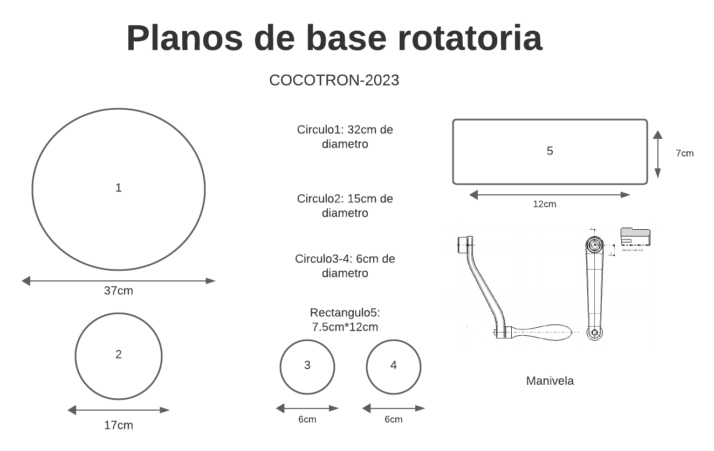

# Xolotcocotron 2023

- **NIVEL EDUCATIVO: PREPARATORIA CRS**

Es un animatrónico inspirado en:
- Un Xoloitzcuintle
- En un alebrije
- En los pueblos prehispánicos y el Mictlán

## Índice

- [Historia](#historia)
  - [Xoloitzcuintles: Guardianes de Almas en la Mitología Prehispánica](#xoloitzcuintles-guardianes-de-almas-en-la-mitología-prehispánica)
  - [Historia y Creencias](#historia-y-creencias)
  - [La Misión de los Xolos](#la-misión-de-los-xolos)
  - [Asociación con Xolotl](#asociación-con-xolotl)
  - [El Significado de su Color](#el-significado-de-su-color)
  - [Legado y Respeto](#legado-y-respeto)

- [Caracterización de los Integrantes](#caracterización-de-los-integrantes)
  - [Mujeres](#mujeres)
  - [Hombres](#hombres)

- [Piezas](#piezas)
  - [Tarjetas](#tarjetas)
  - [Motores](#motores)
  - [Actuador Lineal 3D](#actuador-lineal-3d)
  - [Actuador Lineal](#actuador-lineal)
  - [Circuito Controlador de Motores](#circuito-controlador-de-motores)

- [Uso y control](#uso-y-control)
  - [Detección de Objetos](#detección-de-objetos)
  - [Movimiento Simulado de Caminar](#movimiento-simulado-de-caminar)
  - [Movimiento de Alas](#movimiento-de-alas)
  - [Control de la Dirección con el Joystick](#control-de-la-dirección-con-el-joystick)
  - [Restablecimiento de Posición](#restablecimiento-de-posición)

- [Mesa Rotatoria](#mesa-rotatoria)
  - [Materiales necesarios](#materiales-necesarios)
  - [Preparación de los círculos de madera](#preparación-de-los-círculos-de-madera)
  - [Preparación del eje o valero](#preparación-del-eje-o-valero)
  - [Instalación de la polea y la correa](#instalación-de-la-polea-y-la-correa)
  - [Añadir la manivela](#añadir-la-manivela)
  - [Pruebas y ajustes](#pruebas-y-ajustes)

- [Decoración y Efectos Especiales](#decoración-y-efectos-especiales)
  - [Diseño de Alebrije Tradicional](#diseño-de-alebrije-tradicional)
  - [Cambio de Luz UV Prehispánico](#cambio-de-luz-uv-prehispánico)
  - [Pintura Acrílica y Plumón de Tinta Invisible Casera](#pintura-acrílica-y-plumón-de-tinta-invisible-casera)

- [Integrantes del equipo](#integrantes-del-equipo)
- [Asesor del equipo](#asesor-del-equipo)
- [Referencias](#referencias)

---
# ALGUNAS IMAGENES DEL ANIMATRONICO

  
  

---

---

[Descargar archivo Word]([sketch para la presentacion.docx)](https://github.com/GOLFISHMANALEXIS/CodigoXolot/blob/ef1c0b8e1a19cb6c234e24a0b458462cfff0b597/sketch%20para%20la%20presentacion.docx)

---
## Historia

### Xoloitzcuintles

Guardianes de Almas en la Mitología Prehispánica

Este texto explora la fascinante historia de los Xoloitzcuintles, una raza de perros venerada desde tiempos prehispánicos en la mitología y la cultura mexicana.

### Historia y Creencias

En la creencia prehispánica, se consideraba que estos hermosos animales eran guardianes de los espíritus, encargados de guiar a las almas de los fallecidos en su travesía por Mictlán, la ciudad de los muertos.

### La Misión de los Xolos

La función más importante que se creía que cumplían los Xoloitzcuintles era ayudar a las almas a cruzar un profundo y caudaloso río que atravesaba la tierra de los muertos. Sin embargo, su ayuda no era garantizada.

- Si una persona había tratado mal a los animales, especialmente a los perros, el Xolo se negaría a ayudar, condenando al alma al sufrimiento eterno.
- Si, en cambio, alguien había sido amable y respetuoso con los perros en vida, el Xolo aceptaría la tarea con gusto, llevando el alma a salvo al otro lado.

### Asociación con Xolotl

Los Xoloitzcuintles no solo eran valorados en el mundo espiritual, sino también en vida, ya que estaban asociados con Xolotl, el dios de la muerte. La relación con este dios era importante para asegurar una muerte sin sufrimiento.

### El Significado de su Color

Según la leyenda, el color del Xolo era significativo:

- Xolos negros habían completado su deber espiritual, habiendo guiado suficientes almas, y ya no podían realizar esta tarea.
- Xolos blancos o muy claros eran considerados jóvenes e inexpertos, por lo que no se les permitía llevar a cabo la travesía.
- Los Xolos grises jaspeados, el color más común en ellos, eran los elegidos para la importante tarea de guiar las almas.

  

  <i>AI DALLE</i>

### Legado y Respeto

Este relato nos muestra cómo nuestros antepasados nos transmitieron, a través de la cultura y la tradición, el amor y el respeto por estos hermosos animales que se han convertido en una parte fundamental de nuestras vidas, acompañándonos tanto en vida como en muerte.

## Caracterización de los Integrantes

### Mujeres

- Opción de usar falda náhuatl
- Huipil (blusa)

### Hombres

- Calzón de manta (pantalón y camisa)

  

---
## Piezas

### Tarjetas

- Arduino Mega 2560 Rev3
- Arduino Uno Rev3

### Motores

- 4 servomotores
- 1 motor a pasos con el driver ULN2003A
- 1 motor de corriente directa tipo Faulhaber
- Jumpers macho/macho y macho/hembra (aproximadamente 50)
- 1 sensor ultrasónico SRF04
- 1 pulsador
- Un joystick
- Transistor 2N2222A
- Potenciómetro de 50k
- Resistencia 1kΩ
- Fuente de alimentación 5v-3.3v

### Actuador Lineal

- Un motoreductor 5v
- Un tubo de PVC de 5 cm de diámetro
- Un tubo de PVC de 1.5 cm
- Un espárrago de 1/4
- Una tuerca de 1/4

### Circuito Controlador de Motores

- IC L293D
- Fuente de poder de 5v
- Resistencias de 1k (2)
- Pulsadores (2)
- Cables
- Se puede utilizar para cualquier tipo de motor de corriente directa
 

  

  <i>Esquemático</i>

---

## Uso y control

### Detección de Objetos

- Utiliza el sensor ultrasónico para detectar objetos o usuarios en las proximidades del dispositivo.

### Movimiento Simulado de Caminar

- Cuando el sensor ultrasónico se activa, los 4 servos entran en acción simultáneamente, moviéndose en direcciones opuestas para simular un paso adelante o atrás. Esto crea la ilusión de que el dispositivo está caminando.

### Movimiento de Alas

- Además del movimiento simulado de caminar, el proyecto incorpora un mecanismo de alas que utiliza un sistema de engranajes y un motor DC. Este mecanismo de alas se sincroniza con el movimiento de caminar para simular un movimiento realista, permitiendo que el dispositivo imite el vuelo de un ave u otro patrón de movimiento de alas deseado.

 

  

  <i>Esquemático</i>

 

  

  <i>Esquemático</i>

### Control de la Dirección con el Joystick

- Además de los movimientos mencionados anteriormente, el proyecto emplea un motor a pasos y un joystick para controlar la dirección. Los usuarios pueden girar el joystick para cambiar la dirección del movimiento y dirigir el dispositivo hacia donde deseen.

### Restablecimiento de Posición

- Al finalizar las acciones mencionadas, el pulsador se utiliza para volver a la posición inicial, es decir, 0°, tanto para los 4 motores como para el mecanismo de alas. Esto asegura que el dispositivo regrese a su estado de reposo después de completar las acciones.

---
# Actuador Lineal 3D

A continuación, se presentan los archivos 3D creados para el actuador lineal, que consta de tres partes esenciales: la base que sostiene un motor de 15 kilos, el engrane a medida y el cierre que opera con un movimiento hacia adelante y hacia atrás utilizando un circuito con Arduino.

## Base del Actuador Lineal

[ARCHIVOS 3D de actuador lineal/BASE DEL MOTOR .STL](enlace al archivo 3D de la base)

Descripción: La base del actuador lineal es la parte fundamental que sostiene el motor de 15 kilos y proporciona estabilidad al sistema.

## Engrane a Medida

[ARCHIVOS 3D de actuador lineal/Engranaje.STL](enlace al archivo 3D del engrane)

Descripción: El engrane a medida es una pieza esencial que garantiza un movimiento preciso y controlado en el actuador lineal.

## Cierre para Movimiento Adelante/Atrás

[ARCHIVOS 3D de actuador lineal/CIERRE.STL](enlace al archivo 3D del cierre)

  

Descripción: El cierre permite que el actuador lineal realice movimientos hacia adelante y hacia atrás según lo programado en el circuito controlador de Arduino.

Estos archivos 3D son cruciales para el funcionamiento del actuador lineal y han sido diseñados especialmente para este proyecto animatrónico inspirado en el Xoloitzcuintle y la cultura mexicana.

---

# Mesa Rotatoria

## Materiales necesarios:
- Dos círculos de madera comprimida con el diámetro deseado para la base y la parte superior de la mesa.
- Eje o valero que permitirá la rotación de la parte superior de la mesa.
- Polea y correa para transmitir el movimiento de la manivela al eje.
- Manivela a la medida que permitirá girar la mesa.
- Tornillos y herramientas para ensamblar las piezas.

## Preparación de los círculos de madera:
1. Corta dos círculos de madera comprimida del tamaño deseado para la base y la parte superior de la mesa.
2. Asegúrate de que ambos círculos estén perfectamente nivelados y lisos para facilitar el movimiento de la mesa.

## Preparación del eje o valero:
- Fija el eje o valero en el centro de la base de la mesa, asegurándote de que esté correctamente alineado y asegurado para permitir la rotación.
- Asegura el eje o valero con tornillos para que esté firmemente sujeto a la base.

## Instalación de la polea y la correa:
- Coloca una polea en el extremo del eje o valero que sobresale de la base.
- Coloca la correa alrededor de la polea y la manivela que utilizarás para girar la mesa.

## Añadir la manivela:
- Fija la manivela en el extremo de la correa para permitir el giro de la mesa.
- Asegura la manivela de manera que sea fácilmente accesible para el operador y permita un giro suave de la mesa.

## Pruebas y ajustes:
- Realiza pruebas para asegurarte de que la mesa gire suavemente y que la manivela funcione correctamente.
- Realiza ajustes si es necesario para garantizar un movimiento fluido y seguro de la mesa rotatoria.

 

  

  <i>Planos</i>

## Decoración y Efectos Especiales

### Diseño de Alebrije Tradicional

- Para resaltar la influencia de los alebrijes en el diseño, el animatrónico se decorará con un diseño de alebrije tradicional. Esta colorida y detallada decoración reflejará la tradición artesanal y la creatividad de la cultura mexicana.

### Cambio de Luz UV Prehispánico

- Se incorporará un efecto de cambio de luz utilizando luz ultravioleta (UV) que resalta elementos prehispánicos en la decoración. Cuando se activa la luz UV emitida por el foco incandescente de neón, se revelarán diseños y patrones prehispánicos ocultos en el animatrónico, añadiendo un toque místico y cultural a la presentación.

### Pintura Acrílica y Plumón de Tinta Invisible Casera

- La pintura acrílica se utilizará para realzar los detalles y las texturas del animatrónico. Además, se empleará un plumón de tinta invisible casera que se hará visible solo bajo la luz UV, permitiendo ocultar mensajes o diseños secretos que se revelarán durante la iluminación con luz ultravioleta.

---

## Integrantes

- **Alexis Villegas Alvarado**
- **Ali Michel Lopez Anselmo**
- **Gisell del Carmen Luna Gasca**
- **Fátima Jocelyn Márquez Buendía**

## Asesor

- **Jose David Rivera Garcia**

## Referencias

1. Arduino. (s.f.). Arduino - Home. [https://www.arduino.cc/](https://www.arduino.cc/)
2. Texas Instruments. (s.f.). L293, L293D Quadruple Half-H Drivers. [http://www.ti.com/lit/ds/symlink/l293.pdf](http://www.ti.com/lit/ds/symlink/l293.pdf)
3. National Aeronautics and Space Administration. (s.f.). Solar System Exploration - Faulhaber Motor. [https://solarsystem.nasa.gov/people/516/faulhaber-motor/](https://solarsystem.nasa.gov/people/516/faulhaber-motor/)
4. SRF04 Ultrasonic Range Sensor. (s.f.). [https://www.electronicwings.com/nodemcu/srf04-ultrasonic-range-sensor-interfacing-with-nodemcu](https://www.electronicwings.com/nodemcu/srf04-ultrasonic-range-sensor-interfacing-with-nodemcu)
5. Spice, R. (2021). Understanding and Implementing the L293D H-Bridge Motor Driver. *Circuit Digest*. [https://circuitdigest.com/electronic-circuits/l293d-h-bridge-motor-driver-working-applications](https://circuitdigest.com/electronic-circuits/l293d-h-bridge-motor-driver-working-applications)
6. Universidad de Deusto. (s.f.). El uso de las cámaras oscuras en educación. [https://www.deusto-publicaciones.es/deusto/pdfs/lineadepub/LineaPub_solicituddoc.pdf](https://www.deusto-publicaciones.es/deusto/pdfs/lineadepub/LineaPub_solicituddoc.pdf)
7. Cocotron Team (2023). Circuito controlador de motores [Video corto]. YouTube. [https://www.youtube.com/shorts/cAEhopGSDuE](https://www.youtube.com/shorts/cAEhopGSDuE)
8. Unbox Factory (Año). Actuador Lineal PLOcowiAyscEazkB1Ve5aX_ptNiDTz4OAm [Video]. YouTube. [https://www.youtube.com/watch?v=PLOcowiAyscEazkB1Ve5aX_ptNiDTz4OAm](https://www.youtube.com/watch?v=PLOcowiAyscEazkB1Ve5aX_ptNiDTz4OAm)
9. Gob.mx (s.f.). La leyenda del Xoloitzcuintle, el perro azteca. Gobierno de México. [https://www.gob.mx/siap/articulos/la-leyenda-del-xoloitzcuintle-el-perro-azteca?idiom=es#:~:text=Esta%20particular%20raza%20de%20perros,la%20ciudad%20de%20los%20muertos.](https://www.gob.mx/siap/articulos/la-leyenda-del-xoloitzcuintle-el-perro-azteca?idiom=es#:~:text=Esta%20particular%20raza%20de%20perros,la%20ciudad%20de%20los%20muertos.)
10. Engineering Today (Año). Alas mecanismo basado [Video]. YouTube. [https://www.youtube.com/watch?v=JXcxoOECj8k](https://www.youtube.com/watch?v=JXcxoOECj8k)

---
 

  

  <i>Prepa BUAP CRS</i>

